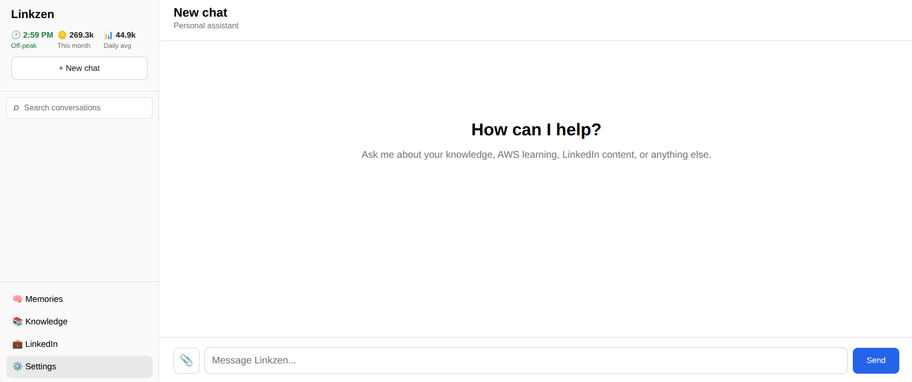
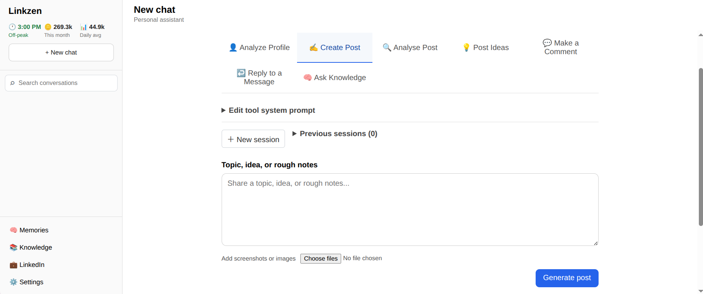
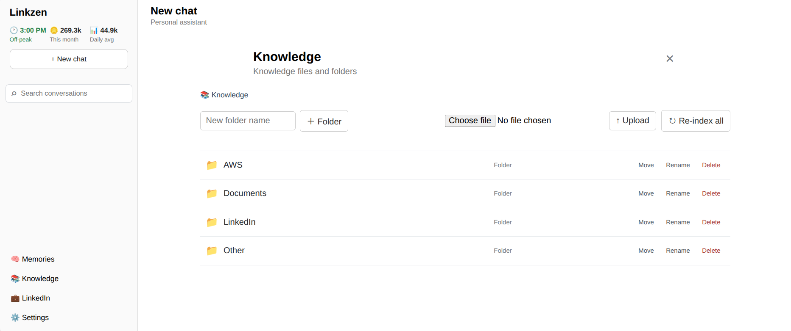

# Linkzen

Linkzen is a personal AI assistant I built mainly to help me grow my LinkedIn presence while keeping the cost of using AI low.

The project combines LinkedIn-focused tools with RAG, a private knowledge base, memory, and other AI features. I also use it as a way to learn about AI engineering by building something that I actually use.

The LinkedIn research and knowledge I use with Linkzen is private and is not included in this repository. The application provides the tools and RAG system, while each user can build their own knowledge base.

## What is Linkzen?

The main focus of Linkzen is helping with different parts of my LinkedIn workflow.

It includes tools for:

- Analysing a LinkedIn profile
- Creating LinkedIn posts
- Analysing posts
- Generating post ideas
- Writing comments
- Replying to messages
- Asking questions about the knowledge base

Alongside the LinkedIn workspace, Linkzen also has a general chat and a knowledge workspace that I use for learning and working with information I have collected.

The goal is to have an AI assistant that can work with useful, relevant information rather than relying only on what the language model already knows.

## Screenshots







## Why I built it

I originally built Linkzen because I wanted an AI tool that could help me grow my LinkedIn presence without spending a lot on AI services.

At the same time, I wanted to learn how AI applications are actually built. This gave me a reason to work with RAG, embeddings, vector databases, document processing, APIs, memory, testing and other parts of an AI application.

Rather than building a small demonstration, I wanted to build something that I could actually use.

## How RAG fits into Linkzen

When relevant knowledge is available, Linkzen can retrieve information from the user's local knowledge base before sending a request to the language model.

The general flow is:

```text
User
  ↓
Linkzen interface
  ↓
FastAPI backend
  ↓
Retrieve relevant knowledge
  ↓
ChromaDB + local embeddings
  ↓
Relevant context
  ↓
DeepSeek API
  ↓
Response
```

Documents are processed and converted into embeddings locally. ChromaDB stores the resulting information so that Linkzen can search for relevant parts later.

The retrieved information is then provided to the language model as context.

## Technology

| Technology              | Purpose                   |
| ----------------------- | ------------------------- |
| Python                  | Main application language |
| FastAPI                 | Backend API               |
| HTML / CSS / JavaScript | Frontend                  |
| DeepSeek API            | Language model            |
| ChromaDB                | Vector database           |
| Sentence Transformers   | Local embeddings          |
| PyPDF                   | PDF processing            |
| Uvicorn                 | Local server              |
| unittest                | Testing                   |

## Project structure

```text
Linkzen/
├── assistant.py
├── server.py
├── rag.py
├── retrieval.py
├── knowledge.py
├── memory.py
├── usage.py
├── web_reader.py
├── chat_images.py
├── settings.py
├── static/
├── knowledge/
├── tests/
├── screenshots/
├── requirements.txt
├── .env.example
├── start-linkzen.sh
└── start-linkzen.ps1
```

## Requirements

- Python 3.12+
- A DeepSeek API key
- Internet access for the language model API
- Enough local storage for the Python environment, embedding model and RAG database

The embedding model runs locally, while the language model is accessed through the DeepSeek API.

## Installation

### Linux / macOS

```bash
git clone https://github.com/Sammy-769/Linkzen.git
cd Linkzen

python3 -m venv .venv
source .venv/bin/activate

pip install -r requirements.txt

cp .env.example .env
```

### Windows

```powershell
git clone https://github.com/Sammy-769/Linkzen.git
cd Linkzen

python -m venv .venv
.venv\Scripts\Activate.ps1

pip install -r requirements.txt

Copy-Item .env.example .env
```

Add your API key to `.env`:

```text
DEEPSEEK_API_KEY=your_api_key_here
```

Do not commit your `.env` file or API key to Git.

## Running Linkzen

### Linux / macOS

```bash
./start-linkzen.sh
```

### Windows

```powershell
.\start-linkzen.ps1
```

The launcher starts the local FastAPI server and opens Linkzen in the browser.

## Knowledge base

The knowledge base is organised into different categories:

```text
knowledge/
├── aws/
├── linkedin/
├── documents/
└── other/
```

Users can add their own documents and information to these areas and use them through Linkzen's retrieval system.

## Memory

Linkzen also has a local memory system separate from the RAG knowledge base.

This allows the application to retain useful information about the user and previous work.

## Testing

The project has a test suite covering parts of the backend, retrieval, memory, settings, usage tracking and LinkedIn-related functionality.

Run the tests with:

```bash
python -m unittest discover -s tests
```

## Privacy and security

Private application data is kept out of Git, including:

- API keys and `.env`
- Local memory
- Usage data
- Settings
- ChromaDB data
- Python virtual environments

## Current limitations

Linkzen is still a personal project and is not intended to be a production multi-user service.

The quality of the AI's results depends on the information available to it, the retrieval quality and the language model being used.

The project is also still being developed, so some parts may change as I continue using and improving it.

## Roadmap

Some areas I want to continue improving include:

- Better retrieval quality
- More reliable LinkedIn tools
- More tests
- Better cross-platform setup
- Improvements to the interface and user experience
- Further reduction of AI/API costs

## What I am learning from the project

Building Linkzen has given me practical experience with:

- RAG systems
- Embeddings
- Vector databases
- Document processing
- API integration
- Prompt design
- Conversation history
- Local memory
- Usage and token tracking
- Testing
- Git and GitHub
- Cross-platform application setup

The project is still evolving, but it has been useful because I am learning these concepts while building something that I actually use.
